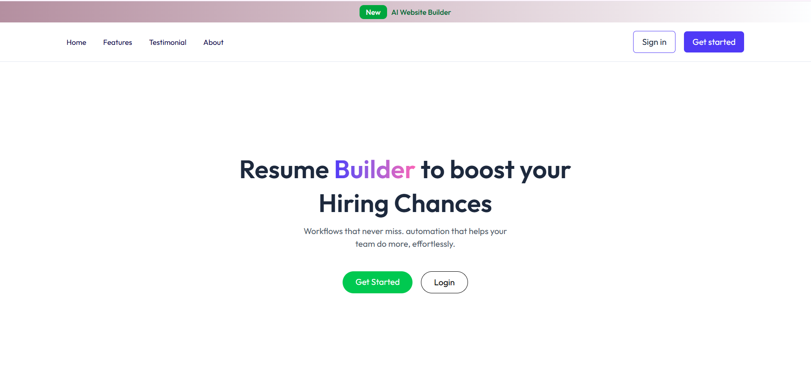
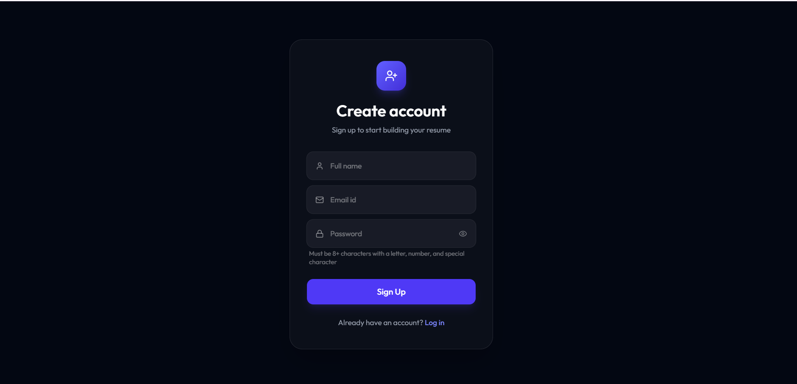
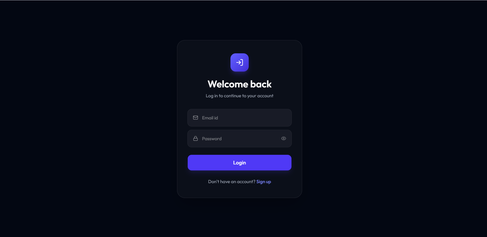
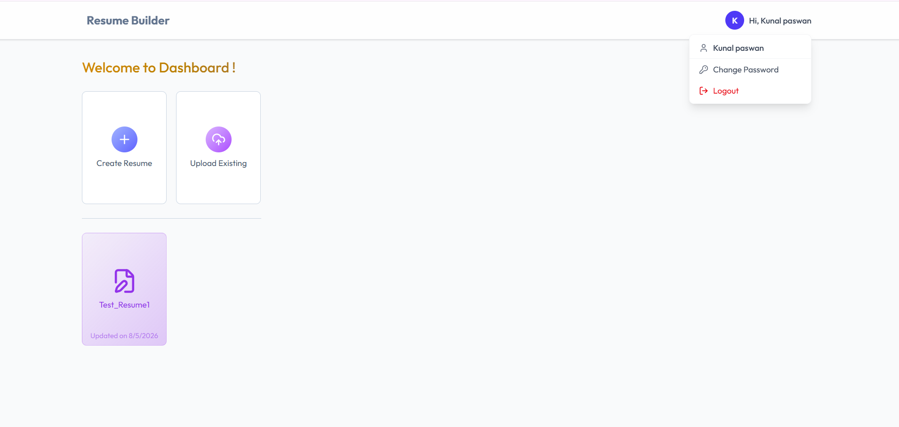
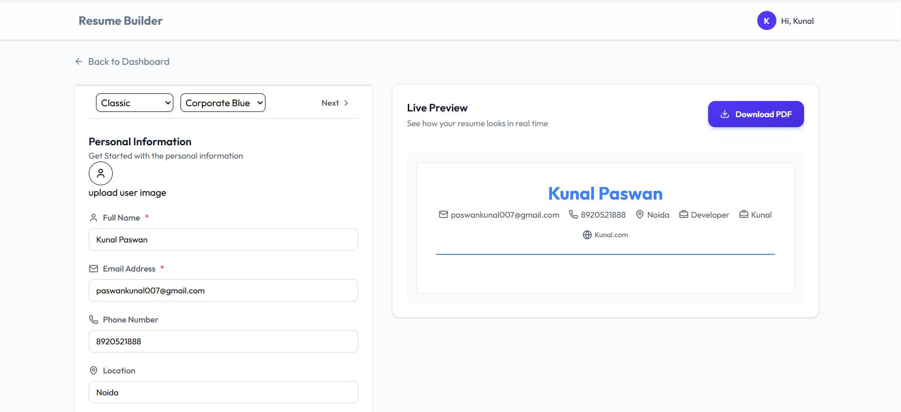
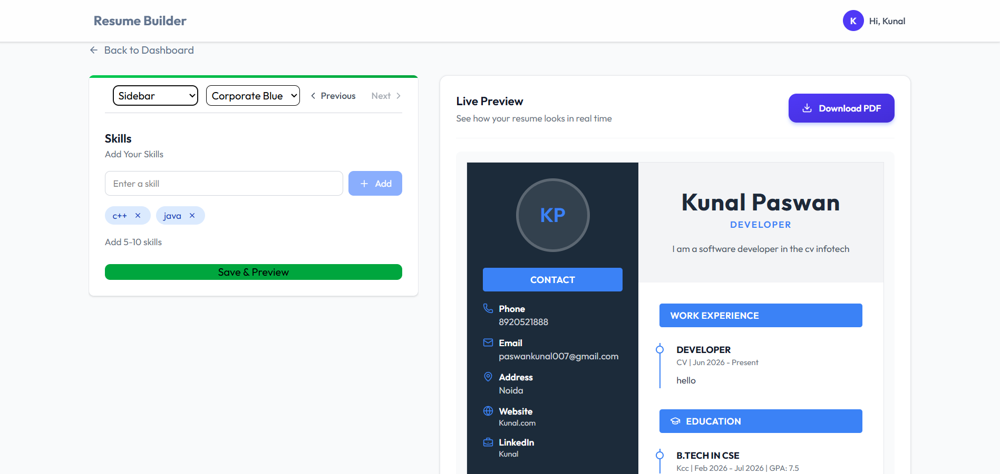
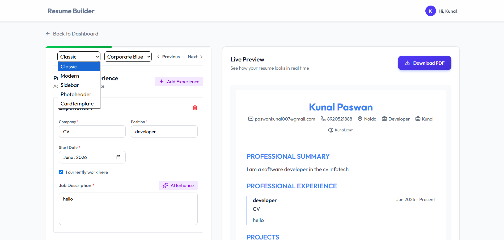

# ai-resume-builder-node-react

AI-powered Resume Builder built with React, Node.js, Express, and MongoDB. Create professional resumes with AI-assisted content generation, switch between multiple templates with real-time preview, and export resumes as PDF.

A modern AI Resume Builder built with:

- ReactJS
- NodeJS
- ExpressJS
- MongoDB

## Features

✔ Create Resume
✔ Multiple Templates
✔ PDF Export
✔ Authentication
✔ Responsive Design

## Tech Stack

### Frontend

- React
- Redux
- Bootstrap

### Backend

- NodeJS
- Express

### Database

- MongoDB

## Installation

```bash
git clone ...
npm install
npm run dev
```

## 📸 Screenshots








